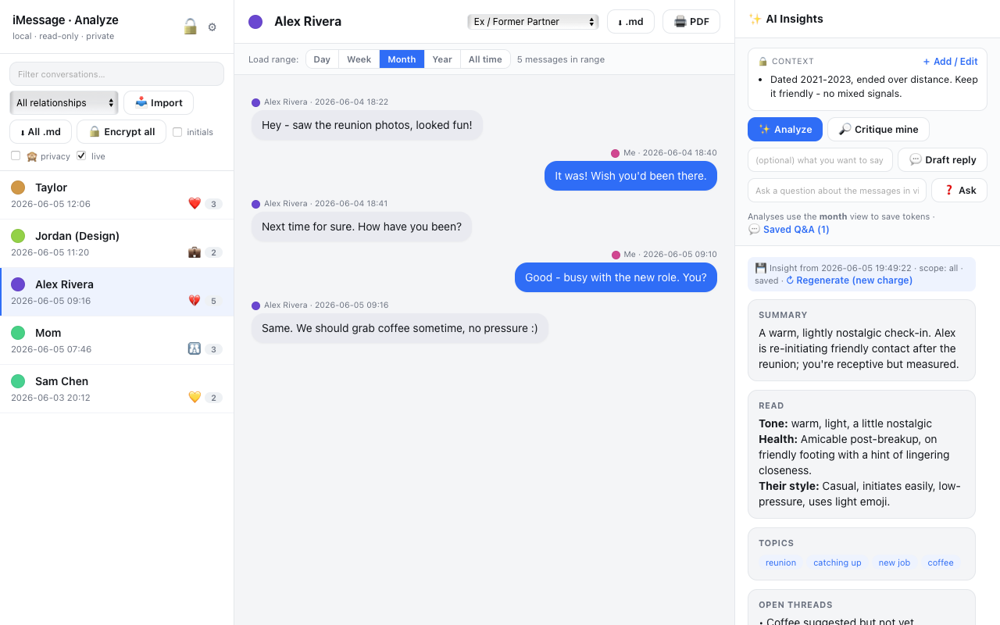

# iMessage Export & Analyze

A **local, private** web tool to browse your Apple Messages threads, get
AI-powered relationship insights, and export them as AI-optimized Markdown,
**encrypted** Markdown, or PDF.

Everything runs on `127.0.0.1`. The Messages database is opened **read-only**.
Your messages and API key never leave your machine.

## Screenshots

_All data below is fictional, captured from `python3 server.py --demo`._



## Features

- **All conversations**, grouped by contact/group, **ordered by most recent**
- Reads **every message** (including modern `attributedBody` messages)
- Resolves contact **names** from your Address Book (best effort)
- **Realtime / always up to date** — reads the live DB on every load; a `live`
  toggle auto-refreshes the thread list and open conversation every 8s
- **AI Insights** per conversation: summary, tone, relationship health,
  the other person's communication style, key topics, open threads, **watch-outs**,
  and **suggested replies tailored to the relationship type you assign**
- **Contact photos** pulled from your Address Book where available, with a
  **colored-dot fallback** (hover = full name) and an **initials / full-name toggle**
  (iCloud-only photos that aren't stored locally fall back to a dot)
- **Filter the thread list by relationship type** (or "Unclassified")
- **Time-range loading** — pick **Day / Week / Month / Year / All time** per
  conversation instead of loading every message (threads can have 50k+); defaults
  to the last month for fast switching
- **Relationship classifier + context** per thread (Family, Friend, Romantic,
  **Ex / Former Partner**, Colleague, Client, …). Context is edited in a modal,
  shown as bullet points, drives the reply strategies, and is stored in an
  **encrypted vault** (see below)
- **Exports:** per-thread Markdown, combined Markdown of everything, printable
  page → Save as PDF, and **AES-256 encrypted** `.md.enc` files

## Requirements

- macOS with Messages set up (`~/Library/Messages/chat.db`)
- Python 3 (preinstalled)
- **Full Disk Access** for the terminal you launch it from
- An **Anthropic API key** (only for the AI Insights feature)

### Grant Full Disk Access (required to read messages)

1. **System Settings → Privacy & Security → Full Disk Access**
2. Enable your terminal (**Terminal** or **iTerm**)
3. **Fully quit** it (⌘Q) and reopen

## Try it instantly (demo mode)

No Mac/Messages/API key required — runs on fictional data:

```bash
python3 server.py --demo
```

Demo mode serves a handful of made-up conversations with canned AI results, so you
can explore the whole UI (and take screenshots) without Full Disk Access, a real
database, an API key, or a vault. Great for trying the tool or contributing.

## Run (real data)

```bash
cd imessage-export
python3 server.py
# options: --port 9000   --no-browser   --demo
```

Opens <http://127.0.0.1:8765>.

## Using the AI Insights

1. Click **⚙ Settings** (top-left) and paste your Anthropic API key.
   With your vault unlocked, the key is **saved encrypted in the vault** and
   auto-restored each time you unlock — no re-entering after restarts. (If the
   vault is locked it stays in memory for the session only. You can also preload
   it: `ANTHROPIC_API_KEY=sk-... python3 server.py`.)
2. Open a conversation, pick a **relationship type** from the dropdown.
3. Click **Analyze**. The AI reads the recent transcript and returns insights +
   reply strategies in the right panel. Click **copy** on any suggested reply.

Models (in Settings): `claude-sonnet-4-6` (default, fast/cheap),
`claude-opus-4-8` (deepest), `claude-haiku-4-5` (cheapest). Only the most recent
~220 messages of a thread are sent, to bound cost.

### Results are cached — you don't pay to regenerate

Every Insights / Draft reply / Critique result is saved per conversation:

- Re-opening a thread shows the saved Insights instantly, **with no API call**.
- Each result shows when it was generated and a **↻ Regenerate** button — only
  that button makes a new (billed) call.
- The cache lives in memory for the session and is **persisted into your
  encrypted vault** when it's unlocked, so it survives restarts (still private —
  AES-encrypted, never plaintext on disk). While the vault is locked, results are
  cached for the session only.

Your typed **context notes** are likewise stored (in the vault) and never cost
anything — they're your text, not generated.

### Analyses use your current view (fewer tokens)

Analyze / Draft reply / Critique / Ask only send the messages in your **current
range** (Day/Week/Month/Year/All). Narrow the window → fewer tokens → lower cost.
The cost-confirm shows the estimate for that scope before each call.

### Ask saved questions

Type a question in the **❓ Ask** box to ask the AI about the messages in view.
Each question and answer is **saved (encrypted) in the vault** and listed under
**💬 Saved Q&A** on the thread — re-open any time for free.

## Encryption

**Exports:** Click **🔒** on a thread (or **🔒 All**) and enter a passphrase. You
get a `*.md.enc` file encrypted with **AES-256-CBC + PBKDF2** (via `openssl`).
The passphrase is passed through the environment, never written to disk or argv.

Decrypt later:

```bash
openssl enc -d -aes-256-cbc -pbkdf2 -in conversation.md.enc -out conversation.md
```

**Relationship vault:** Your relationship classifications and context notes are
saved to `~/.imessage-export/relationships.json.enc`, encrypted with a **vault
password** you set in **⚙ Settings** (or by clicking the 🔒 in the top-left).

- The password is held **in memory only** — never written to disk.
- On disk there is only the AES-encrypted blob; no plaintext is ever stored.
- Each time you start the server the vault is **locked**; enter your password
  once per session to unlock. A wrong password leaves it locked.
- Notes (e.g. breakup context) are never shown or sent anywhere until you unlock.

> Keep your vault password safe — it cannot be recovered. If you forget it,
> delete `~/.imessage-export/relationships.json.enc` and start fresh.

## AI-optimized Markdown format

```
# Conversation: Jane Doe
- **Type:** Direct message
- **Participants:** Jane Doe
- **Relationship:** Close Friend
- **Date range:** 2024-01-03 09:12:01 → 2026-06-05 14:40:22
- **Message count:** 1432
---
[2024-01-03 09:12:01] Jane Doe: Hey, are we still on for Friday?
[2024-01-03 09:13:40] Me: Yep, 7pm works.
```

Plain text, one message per line with explicit sender + timestamp — ideal to
paste into an LLM for summarization or analysis.

## Privacy notes

- The tool **never writes** to `chat.db` (`mode=ro&immutable=1`).
- Relationship classifications & notes are stored **encrypted** at
  `~/.imessage-export/relationships.json.enc` (AES-256, your vault password).
- AI Insights send recent transcript text to the Anthropic API **only when you
  click Analyze**. Nothing is sent otherwise.
- Attachments are noted as `[attachment]`; files aren't inlined or uploaded.
